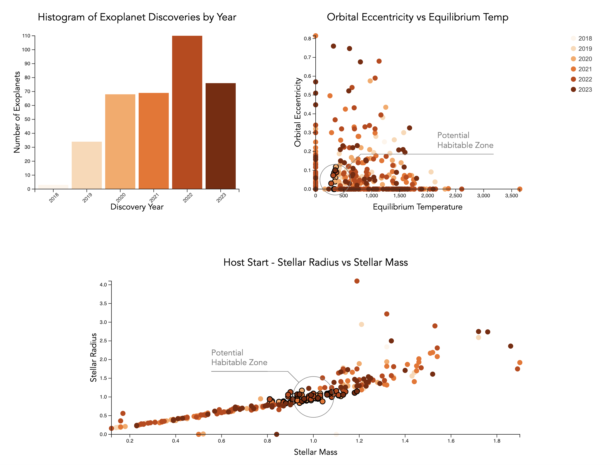
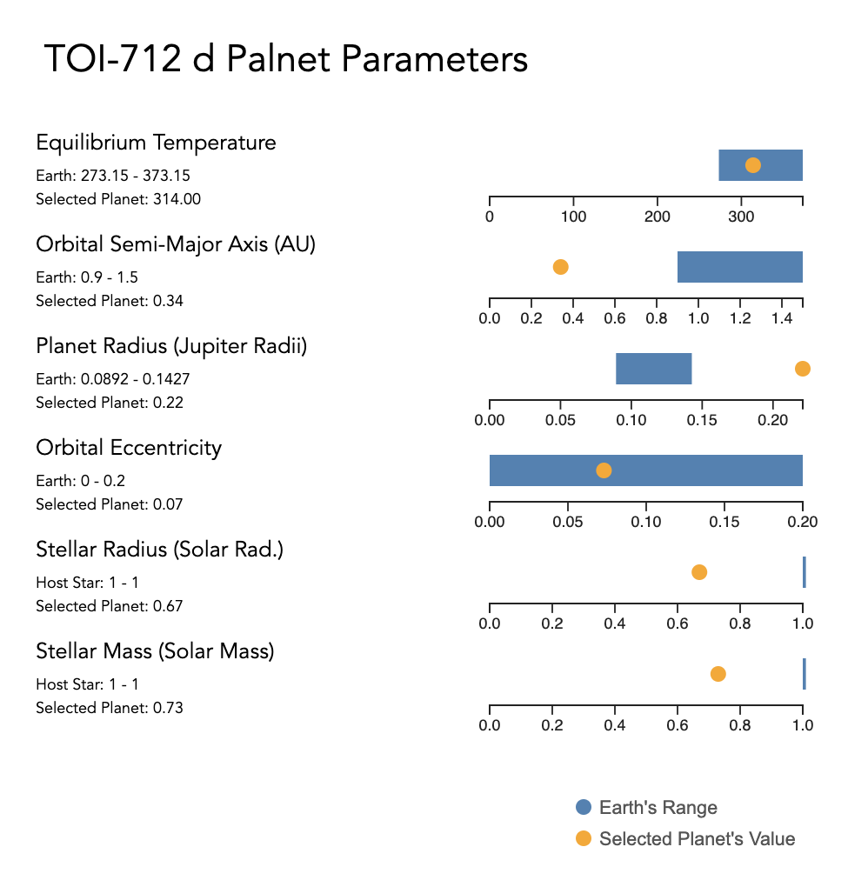
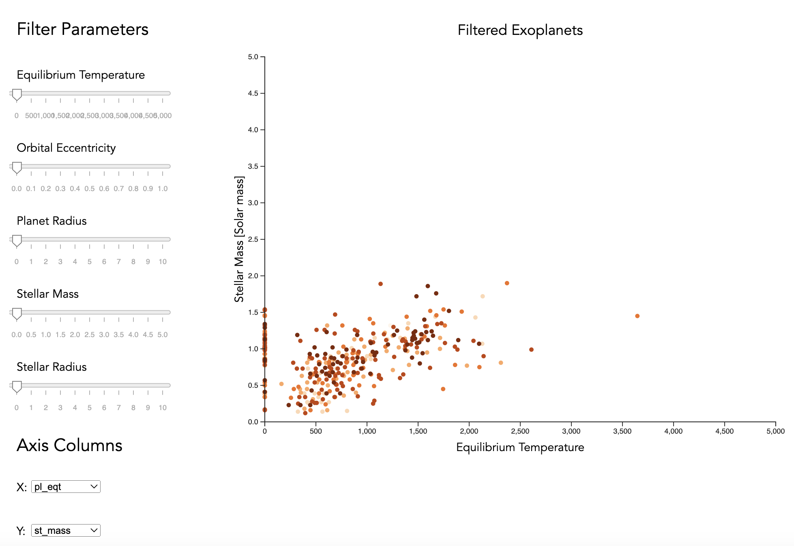

# NASA TESS Mission Narrative
 A narrative visualization project showcasing TESS's mission and exploring Earth-like exoplanets.

# Martini Glass Structure
## Storyline:
- Scene 1 : Overview of exoplanets discovered by TESS by years. The user can get to the next scene by clicking on a specific planet in the scatter plot.
- Scene 2 : Detailed view of the selected exoplanet's characteristics like Equilibrium Temperature and Orbital Eccentricity.
- Scene 3 : Interactive exploration scene where user can filter or search planets based on their characteristics.

### Scene1
Scene 1 offers a profound look into the timeline of the Transiting Exoplanet Survey Satellite (TESS) discoveries. It highlights the planets with characteristics similar to Earth.

### Scene2
Scene 2 provides a toolkit to delve into the attributes of individual planets. It lets you contrast the aspects of planet parameters with those of Earth.

### Scene3
Scene 3 brings an interactive dashboard that evolves the visualization based on your preferences for a tailored analytical insight.

